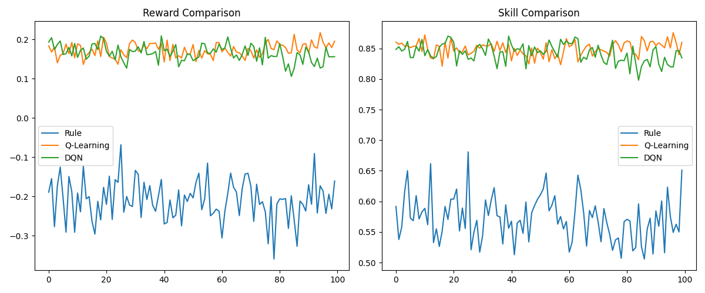

# TypeRL

An adaptive typing tutor powered by Reinforcement Learning. Instead of random sentence selection, TypeRL learns which bigrams you struggle with and schedules targeted exercises to maximize your long-term typing improvement.

---

## Overview

Most typing tutors (MonkeyType, Keybr, TypeRacer) use static or random sentence selection. TypeRL treats exercise selection as a **sequential decision-making problem** and solves it with RL — choosing *which* character pattern to practice, *how hard* to make it, and *when to revisit* previously learned patterns.

Typing skill is modeled as a vector of **bigram mastery levels** (e.g., `th`, `er`, `qu`, `st`). The RL agent learns a curriculum policy that maximizes cumulative skill improvement across all bigrams.

---

## How It Works

### Bigram Skill Model

40 tracked bigrams cover the most frequent English character transitions. Each bigram has a mastery score:

$$k_b \in [0, 1]$$

Skills increase with practice and decay with neglect.

---

### Skill Update Rule

When bigram $b$ appears in the sentence:

$$k_b^{t+1} = k_b^t + \underbrace{\alpha \cdot acc_b \cdot \log(1 + c_b) \cdot (1 - k_b^t)}_{\text{learning}} \ -\ \underbrace{\lambda \cdot (1 - k_b^t) \cdot \log(1 + t_b)}_{\text{forgetting}}$$

When bigram $b$ does not appear:

$$k_b^{t+1} = k_b^t - \lambda \cdot (1 - k_b^t) \cdot \log(1 + t_b)$$

| Symbol | Meaning | Value |
|--------|---------|-------|
| $\alpha$ | Learning rate | 0.08 |
| $\lambda$ | Forgetting rate | 0.002 |
| $acc_b$ | Simulated typing accuracy for bigram $b$ | — |
| $c_b$ | Number of times bigram appeared in the sentence | — |
| $t_b$ | Steps since bigram was last practiced | — |

The $(1 - k_b)$ factor in both terms ensures **diminishing returns** — improvement slows as mastery approaches 1, and forgetting is gentler on already-weak skills. Logarithmic scaling on both $c_b$ and $t_b$ prevents runaway growth from excessive repetition or long gaps.

---

### Typing Performance Simulation

Difficulty level $\ell \in \{0, 1, 2, 3, 4\}$ is mapped nonlinearly to a difficulty strength:

$$d_\ell = 0.2 \cdot \ell^{\,1.5}$$

The probability of correctly typing bigram $b$ at difficulty $\ell$ is modeled with the logistic function:

$$p_b = \sigma(k_b - d_\ell) = \frac{1}{1 + e^{-(k_b - d_\ell)}}$$

For each of the $c_b$ occurrences of bigram $b$ in the sentence, a Bernoulli trial is drawn:

$$X_i \sim \text{Bernoulli}(p_b), \qquad i = 1, \ldots, c_b$$

Typing accuracy is then:

$$acc_b = \frac{1}{c_b} \sum_{i=1}^{c_b} X_i$$

This accuracy feeds directly into the skill update, scaling the learning term.

---

### MDP Formulation

| Component | Definition |
|-----------|------------|
| **State** | $s_t = [ \mathbf{k}_t \| \mathbf{t}_t] \in \mathbb{R}^{80}$ — bigram skill levels concatenated with practice timers |
| **Action** | $a_t = (b_t\, \ell_t)$ — target bigram × difficulty, encoded as $a = b \cdot L + \ell$, giving $\|\mathcal{A}\| = 40 \times 5 = 200$ |
| **Transition** | Skill and timer updates as above |
| **Reward** | See below |
| **Discount** | $\gamma = 0.99$ |

---

### Reward Function

$$r_t = 2.0 \cdot \Delta\bar{k} +\ 0.3 \cdot acc_{b_t} +\ 0.3 \cdot \min_b\, k_b -\ 0.1 \cdot \bar{t}$$

| Term | Role |
|------|------|
| $\Delta\bar{k} = \bar{k}_{t+1} - \bar{k}_t$ | Rewards overall skill growth |
| $acc_{b_t}$ | Rewards accurate performance on the target bigram |
| $\min_b\, k_b$ | Penalizes neglecting the weakest bigram |
| $\bar{t} = \frac{1}{K}\sum_b t_b$ | Penalizes letting patterns go unpracticed |

The $\min_b\, k_b$ term is the most important design choice — without it, agents converge to drilling easy bigrams and maximizing the average while ignoring weak ones.

---

## Agents

### Rule-Based (Baseline)

Greedy heuristic — always targets the bigram with the lowest score, sets difficulty based on current skill. No training required.

$$b^* = \arg\min_b \bigl(k_b - 0.1 \cdot t_b\bigr)$$

| Skill $k_b$ | Difficulty assigned |
|-------------|-------------------|
| $[0.00,\; 0.30)$ | 0 |
| $[0.30,\; 0.50)$ | 1 |
| $[0.50,\; 0.70)$ | 2 |
| $[0.70,\; 0.85)$ | 3 |
| $[0.85,\; 1.00]$ | 4 |

---

### Q-Learning

Tabular RL agent. State is compressed to mean skill $\bar{k}$ and discretized into $N = 20$ bins. Q-table shape: $(20, 200)$. Update rule:

$$Q(s, a) \leftarrow\ Q(s, a) + \alpha_Q \Bigl[\ r + \gamma \max_{a'} Q(s', a') - Q(s, a) \Bigr]$$

| Hyperparameter | Value |
|----------------|-------|
| $\alpha_Q$ | 0.3 |
| $\gamma$ | 0.99 |
| $\epsilon_0$ | 1.0 |
| $\epsilon$ decay | 0.999 |
| $\epsilon_{\min}$ | 0.05 |
| Bins $N$ | 20 |

> **Limitation:** Compressing state to $\bar{k}$ loses all per-bigram information. The agent cannot distinguish which specific bigrams are weak.

---

### DQN (Deep Q-Network)

Neural RL agent operating on the **full state** $s_t \in \mathbb{R}^{80}$. Eliminates the discretization bottleneck of Q-learning entirely.

**Architecture:** $Q_\theta\ : \mathbb{R}^{80} \to \mathbb{R}^{200}$
```
Linear(80 → 128) → ReLU → Linear(128 → 128) → ReLU → Linear(128 → 200)
```

**Loss:**

$$\mathcal{L}(\theta) = \mathbb{E}\left[\left(Q_\theta(s, a) - \Bigl(r + \gamma \max_{a'} Q_{\theta^-}(s', a')\Bigr)\right)^2\right]$$

where $\theta^-$ denotes the target network parameters.

| Hyperparameter | Value |
|----------------|-------|
| Optimizer | Adam, lr = 1e-3 |
| Replay buffer | 10,000 |
| Batch size | 64 |
| Target network update | Every 5 episodes |
| $\gamma$ | 0.99 |
| $\epsilon_0$ → $\epsilon_{\min}$ | 1.0 → 0.05 (decay 0.995) |

---

## Results

> 100 episodes × 200 steps per episode, same environment across all agents.

| Agent | Avg Reward | Final Mean Skill $\bar{k}$ |
|-------|-----------|--------------------------|
| Rule-Based | — | — |
| Q-Learning | — | — |
| DQN | — | — |

*Fill in after running `compare_agents.py`.*



## Demo

This animation is the quickest way to inspect whether a reward change is helping the weakest bigrams or just inflating the average.


## Reward Debug Log

I ran into a reward-shaping problem during development: an early version of the environment rewarded average skill too heavily, so the agents could look better on aggregate while still neglecting the weakest bigram.

The current version makes that issue visible and easier to debug by logging the reward components directly from the environment and by keeping the weakest-skill term in the reward. That gives me a clear before/after baseline for future reward improvements.

Planned follow-up work:

1. Compare the current reward against the next reward revision using the same visualization.
2. Tune the reward weights and confirm the weakest bigram improves, not just the mean.
3. Keep the README updated with each reward iteration so the project history stays auditable.

---

## Project Structure
```
TypeRL/
├── bigrams.py                   # 40 tracked English bigrams
├── text_processing.py           # Bigram extraction from sentences
├── generate_dataset.py          # LLM dataset generation (Groq / Llama 3.1)
├── dataset_loader.py            # O(1) sentence sampling by (bigram, difficulty)
├── typing_env.py                # Core RL environment (MDP)
├── rule_based_agent.py          # Greedy heuristic baseline
├── q_learning.py                # Tabular Q-learning agent
├── dqn_agent.py                 # Deep Q-Network agent (PyTorch)
├── compare_agents.py            # Train and compare all three agents
├── typing_component.py          # Streamlit interactive typing UI (HTML/JS)
├── typing_dataset_cleaned.csv
└── figs/                        # Output plots
```

---

## Getting Started

**1. Install dependencies**
```bash
pip install numpy torch matplotlib streamlit groq python-dotenv tenacity
```

**2. Generate the dataset** (skip if you already have `typing_dataset_cleaned.csv`)
```bash
echo "GROQ_API_KEY=your_key_here" > .env
python generate_dataset.py
```

**3. Train and compare all agents**
```bash
python compare_agents.py
```

**4. Run individual agents**
```bash
python rule_based_agent.py
python q_learning.py
python dqn_agent.py
```

---

## Dataset

Sentences were generated using **Llama 3.1-8b via Groq API**.

$$40 \text{ bigrams} \times 5 \text{ difficulties} \times 20 \text{ sentences} = 4{,}000 \text{ sentences}$$

Each sentence is constrained to contain the target bigram **at least 5 times**, use natural English flow, and match the assigned difficulty level (simple vocabulary at level 0 through complex sentence structure at level 4).

---

## Key Design Decisions

- **Logarithmic forgetting** over linear — $\log(1 + t_b)$ prevents skill collapse during long gaps; linear decay was too aggressive in practice
- **Nonlinear difficulty** $d_\ell = 0.2 \cdot \ell^{1.5}$ — better reflects real-world difficulty growth than linear scaling
- **$\min_b\, k_b$ in reward** — forces attention to the weakest bigram rather than optimizing the mean
- **LLM-generated sentences** — decouples sentence generation from the learning model; any sentence source producing bigram counts is compatible
- **Full state for DQN** — unlike Q-learning, DQN sees all 40 per-bigram skills and timers, enabling fine-grained curriculum decisions

---
