# TypeRL — Reinforcement Learning for Adaptive Typing Practice

> **An intelligent typing tutor that learns your weaknesses and builds a curriculum around them.**
> Instead of random sentence selection, TypeRL models your typing proficiency at the level of character transitions and uses RL to schedule targeted, personalized practice.

<p align="center">
  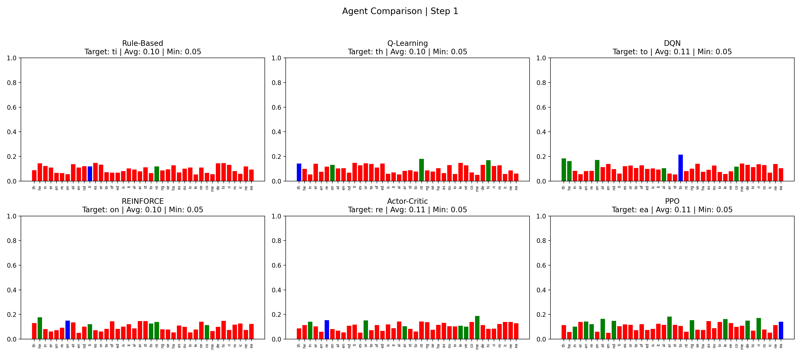
</p>

<p align="center">
  <a href="#">🌐 Live Demo</a> &nbsp;|&nbsp;
  <a href="#-getting-started">🚀 Quick Start</a> &nbsp;|&nbsp;
  <a href="#-how-it-works">📖 How It Works</a> &nbsp;|&nbsp;
  <a href="#-results">📊 Results</a> &nbsp;|&nbsp;
  <a href="#-ablation-studies">🔬 Ablation Studies</a>
</p>

---

## 🌐 Live Demo

**[→ Try TypeRL here](#)** *(link will be updated once deployed)*

---

## The Problem with Existing Typing Tutors

Most typing tutors — MonkeyType, Keybr, TypeRacer — use static or randomly generated text. They improve *average* speed, but they don't know your specific weaknesses and can't adapt to them.

Typing skill is highly **non-uniform**. A user may be fluent in common transitions like `th` or `he` while consistently struggling with `qu` or `ve`. Static practice fails to close this gap — it just keeps reinforcing what you already know.

TypeRL treats exercise selection as a **sequential decision-making problem** solved with Reinforcement Learning:

- *Which* character transition should you practice right now?
- *How difficult* should the exercise be?
- *When* should a previously learned pattern be revisited before it fades?

---

## 📖 How It Works

### Step 1 — Decompose Typing Skill into Bigrams

Instead of tracking a single WPM score, TypeRL represents proficiency as a vector of 40 high-frequency English character transitions (bigrams): `th`, `he`, `er`, `an`, `st`, `ve`, `qu`, ...

Each bigram has a mastery score $k_b \in [0, 1]$. The agent observes all 40 scores at once and decides what to practice next.

---

### Step 2 — Simulate Typing Performance

Difficulty level $\ell \in \{0, 1, 2, 3, 4\}$ is mapped nonlinearly to a continuous strength:

$$d_\ell = 0.2 \cdot \ell^{1.5}$$

The probability of correctly typing bigram $b$ at difficulty $\ell$ follows a logistic (sigmoid) model — analogous to Item Response Theory in educational measurement:

$$p_b = \sigma(k_b - d_\ell) = \frac{1}{1 + e^{-(k_b - d_\ell)}}$$

| Condition | Result |
|-----------|--------|
| Skill $\gg$ Difficulty | $p_b \approx 1.0$ — easy success |
| Skill $\approx$ Difficulty | $p_b \approx 0.5$ — at threshold |
| Skill $\ll$ Difficulty | $p_b \approx 0.0$ — overwhelmed |

For each occurrence of the bigram in the sentence, a Bernoulli trial is drawn:

$$X_i \sim \text{Bernoulli}(p_b), \qquad \text{acc}_b = \frac{1}{c_b} \sum_{i=1}^{c_b} X_i$$

This accuracy feeds directly into the skill update — poor performance yields smaller improvement.

<p align="center">
  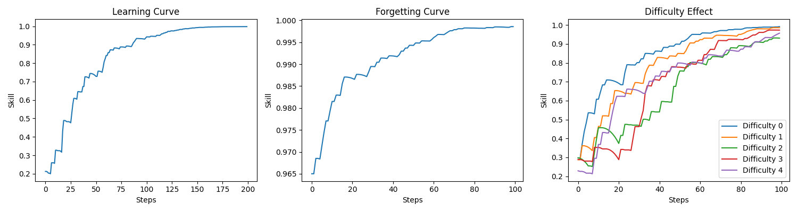
</p>

*The figure above shows the logistic performance curve, the nonlinear difficulty scaling, and the shape of the learning and forgetting functions.*

---

### Step 3 — Skill Dynamics: Learning and Forgetting

Skills evolve at every step according to two competing forces.

**When bigram $b$ is practiced:**

$$k_b^{t+1} = \text{clip}\!\left(k_b^t + \underbrace{\alpha \cdot \text{acc}_b \cdot \log(1+c_b) \cdot (1-k_b^t)}_{\text{learning}} \;-\; \underbrace{\lambda \cdot (1-k_b^t) \cdot \log(1+t_b)}_{\text{forgetting}},\; 0,\; 1\right)$$

**When bigram $b$ is not practiced:**

$$k_b^{t+1} = \text{clip}\!\left(k_b^t - \lambda \cdot (1-k_b^t) \cdot \log(1+t_b),\; 0,\; 1\right)$$

| Symbol | Meaning | Value |
|--------|---------|-------|
| $\alpha$ | Learning rate | 0.08 |
| $\lambda$ | Forgetting rate | 0.003 |
| $\text{acc}_b$ | Typing accuracy on bigram $b$ | — |
| $c_b$ | Bigram occurrences in the sentence | — |
| $t_b$ | Steps since bigram was last practiced | — |

**Why each term matters:**

- **$(1 - k_b)$** — diminishing returns: improving 0.3→0.4 is much easier than 0.9→1.0, matching real skill acquisition research.
- **$\log(1 + c_b)$** — sub-linear exposure benefit: the 10th repetition yields less gain than the first.
- **$\text{acc}_b$** — performance gate: erroneous practice doesn't get rewarded.
- **Logarithmic forgetting** — mastered skills decay slowly; both learning and forgetting scale with $(1-k_b)$, mirroring the empirical spacing effect.

---

### Step 4 — The MDP

| Component | Definition |
|-----------|------------|
| **State** | $s_t = [\mathbf{k}_t \;\|\; \mathbf{t}_t] \in \mathbb{R}^{80}$ — 40 skill levels concatenated with 40 practice timers |
| **Action** | $a_t = (b_t,\, \ell_t)$ — target bigram × difficulty; encoded as $a = b \cdot 5 + \ell$, giving $|\mathcal{A}| = 200$ |
| **Transition** | Skill and timer updates above |
| **Reward** | Multi-objective (see below) |
| **Discount** | $\gamma = 0.99$ |

The **timer vector** is a deliberate design choice. Without it, the agent has no signal to revisit neglected bigrams and collapses to a small, easy subset.

---

### Step 5 — Reward Function

The reward balances five complementary objectives, with weights tuned via Optuna hyperparameter search:

$$r_t = w_{\Delta k}\,\Delta\bar{k} + w_{\text{acc}}\,\text{acc}_{b_t} + w_{\text{weak}}\,\bar{k}_{\text{weak}} - w_t\,\bar{t} - w_{\text{std}}\,\tilde{\sigma}_k$$

where $\bar{k}_{\text{weak}}$ = mean of the 5 weakest bigrams, and $\tilde{\sigma}_k = \min(\sigma_k, 0.3)$.

| Term | Meaning | Weight | Why It's Needed |
|------|---------|--------|-----------------|
| $\Delta\bar{k}$ | Average skill improvement | **4.33** | Primary driver of overall progress |
| $\text{acc}_{b_t}$ | Accuracy on target bigram | **0.04** | Stabilises the learning signal |
| $\bar{k}_{\text{weak}}$ | Mean of weakest 5 bigrams | **1.25** | Prevents neglect of difficult patterns |
| $\bar{t}$ | Mean practice timer | **−0.60** | Forces periodic revisitation |
| $\tilde{\sigma}_k$ | Clipped skill std dev | **−0.40** | Penalises skill imbalance |

**Failure modes addressed by each term:**

> Without `weak_avg` → agent exploits easy bigrams, weak ones are never recovered  
> Without timer penalty → neglected bigrams silently decay over time  
> Without accuracy → noisy updates; the agent can't separate productive from failed practice  
> Without variance penalty → high average skill can mask extreme per-bigram disparities

---

## 🤖 Agents

Six agents are implemented and compared — five learned, one deterministic baseline.

### Rule-Based Baseline

No training required. Always targets the bigram with the lowest adjusted score:

$$b^* = \arg\min_b \left(k_b - 0.1 \cdot t_b\right)$$

Difficulty is assigned by fixed thresholds. A strong, interpretable benchmark.

| Skill $k_b$ | Assigned Difficulty |
|-------------|-------------------|
| $[0.00,\;0.30)$ | 0 |
| $[0.30,\;0.50)$ | 1 |
| $[0.50,\;0.70)$ | 2 |
| $[0.70,\;0.85)$ | 3 |
| $[0.85,\;1.00]$ | 4 |

<p align="center">
  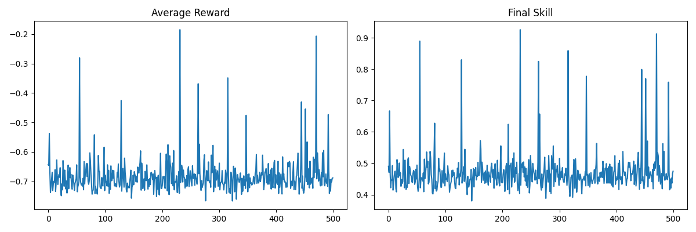
</p>

---

### Q-Learning

Tabular agent with state compressed to mean skill $\bar{k}$ discretized into 20 bins. Q-table shape: $(20, 200)$.

$$Q(s, a) \leftarrow Q(s, a) + \alpha_Q \left[r + \gamma \max_{a'} Q(s', a') - Q(s, a)\right]$$

> **Fundamental limitation:** Compressing the full state to a scalar $\bar{k}$ loses all per-bigram information. The agent cannot distinguish which specific bigrams are weak.

<p align="center">
  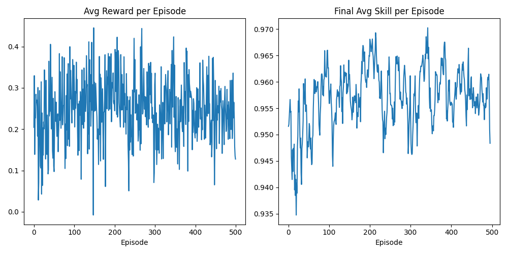
</p>

---

### DQN (Deep Q-Network)

Operates on the full $\mathbb{R}^{80}$ state. Eliminates the discretization bottleneck of Q-Learning entirely.

**Architecture:** $Q_\theta : \mathbb{R}^{80} \to \mathbb{R}^{200}$

```
Linear(80 → 128) → ReLU → Linear(128 → 128) → ReLU → Linear(128 → 200)
```

| Hyperparameter | Value |
|----------------|-------|
| Optimizer | Adam, lr = 1e-3 |
| Replay buffer | 10,000 |
| Batch size | 64 |
| Target network update | Every 5 episodes |
| $\gamma$ | 0.99 |
| $\epsilon$ schedule | 1.0 → 0.05 (decay 0.995) |

<p align="center">
  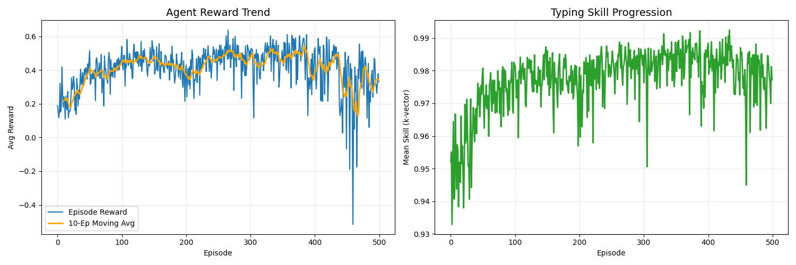
</p>

---

### REINFORCE

Monte Carlo policy gradient. Directly optimises expected return:

$$J(\theta) = \mathbb{E}\!\left[\sum_t G_t \log \pi_\theta(a_t \mid s_t)\right]$$

Stochastic policy naturally encourages exploration. Main limitation: high gradient variance slows convergence.

<p align="center">
  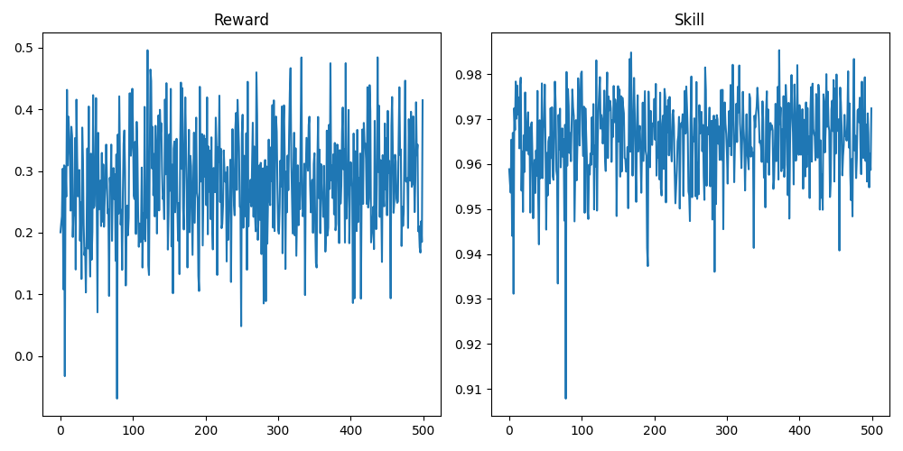
</p>

---

### Actor-Critic

Reduces REINFORCE variance with a learned value baseline:

$$A_t = r_t + \gamma\,V(s_{t+1}) - V(s_t)$$

$$\nabla_\theta J(\theta) \approx \mathbb{E}\!\left[A_t \,\nabla_\theta \log \pi_\theta(a_t \mid s_t)\right]$$

<p align="center">
  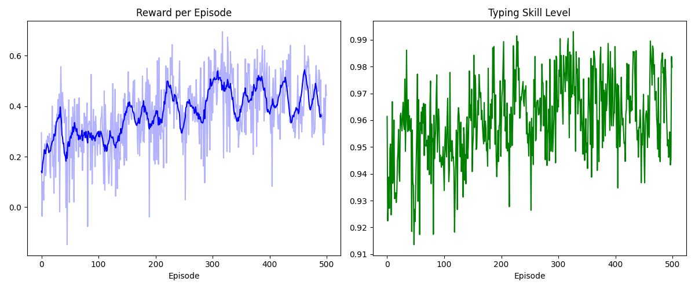
</p>

---

### PPO (Proximal Policy Optimization) ⭐ Best

Clips the policy update ratio to a trust region, preventing catastrophically large updates:

$$L^{\text{CLIP}}(\theta) = \mathbb{E}\!\left[\min\!\left(r_t(\theta)\,A_t,\;\text{clip}(r_t(\theta),\,1{-}\epsilon,\,1{+}\epsilon)\,A_t\right)\right]$$

Achieves the best trade-off between exploration, stability, and sample efficiency.

<p align="center">
  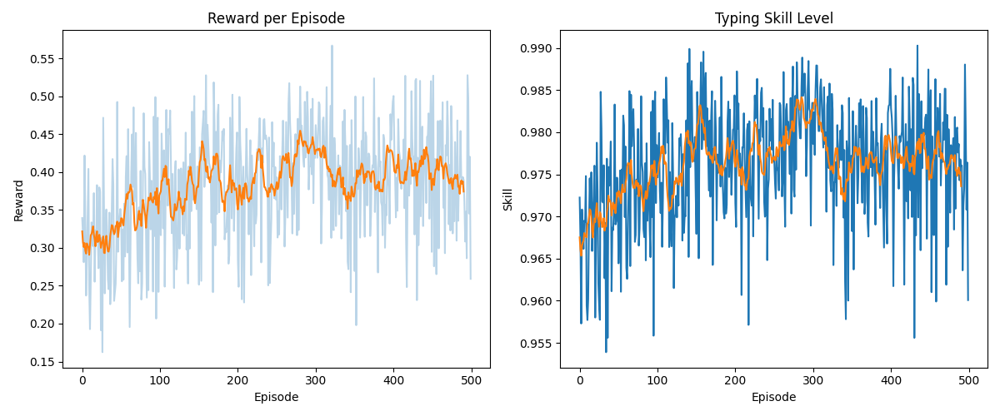
</p>

---

## 📊 Results

All agents trained for 200–300 episodes × 300 steps. Evaluated on three complementary metrics:

| Metric | Formula | Priority |
|--------|---------|----------|
| Average Skill | $\bar{k} = \frac{1}{K}\sum_b k_b$ | Medium |
| **Minimum Skill** | $k_{\min} = \min_b k_b$ | **Highest** |
| Skill Variance | $\sigma_k^2 = \frac{1}{K}\sum_b (k_b - \bar{k})^2$ | Medium |

> **Why minimum skill is the primary metric:** A system can achieve high *average* skill while completely abandoning difficult bigrams — exactly the failure mode of static tutors. $k_{\min}$ directly measures whether the agent has solved this.

### All Agents — Head-to-Head Comparison

<p align="center">
  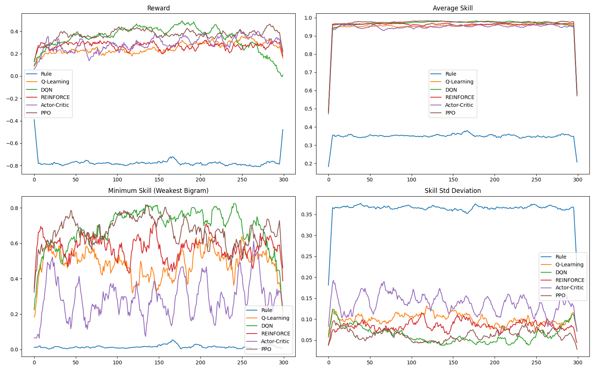
</p>

<p align="center">
  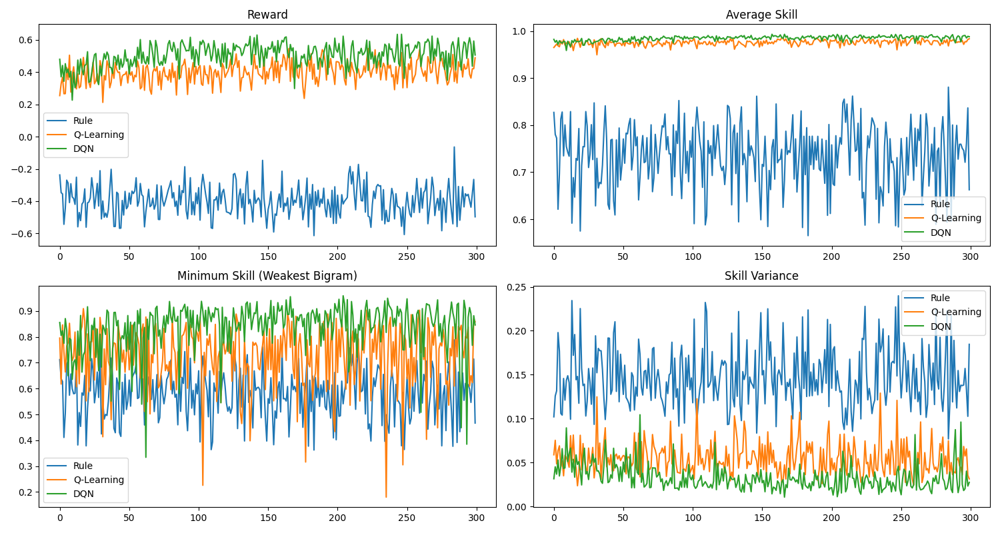
</p>

<p align="center">
  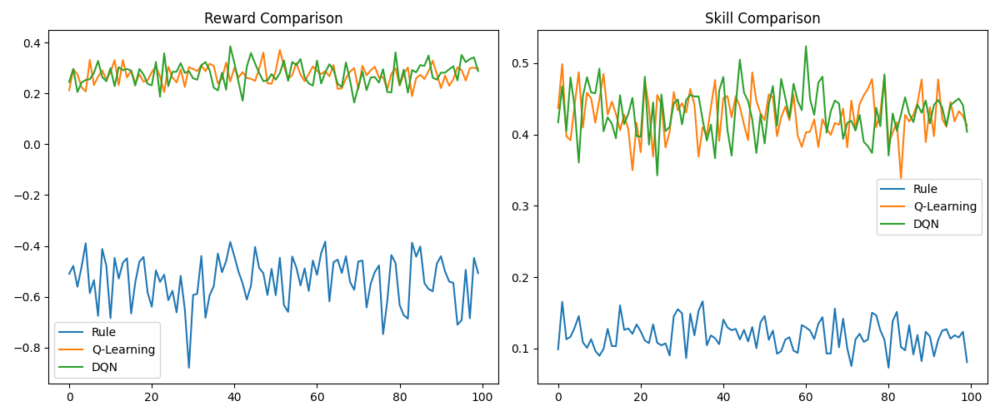
</p>

| Agent | Coverage | Stability | Min Skill | Verdict |
|-------|----------|-----------|-----------|---------|
| Q-Learning | ❌ Low | ❌ Low | ❌ Poor | State compression kills performance |
| Rule-Based | ⚠️ Moderate | ✅ High | ⚠️ Moderate | Strong baseline, no adaptability |
| REINFORCE | ✅ High | ⚠️ Low | ⚠️ Moderate | Noisy gradients slow convergence |
| DQN | ⚠️ Moderate | ✅ Moderate | ⚠️ Moderate | Sensitive to reward design |
| Actor-Critic | ✅ High | ✅ Moderate | ✅ Good | Better than REINFORCE alone |
| **PPO** | ✅ **Best** | ✅ **Best** | ✅ **Best** | Best balance across all metrics |

### Learning Curves

<p align="center">
  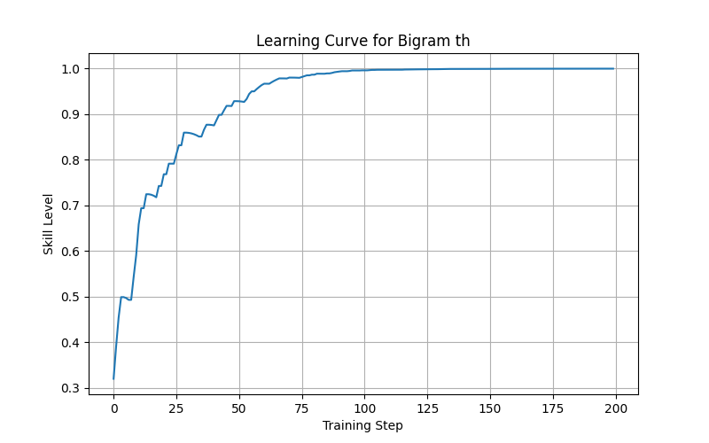
</p>

---

## 🔬 Ablation Studies

### Reward Component Ablation (PPO)

PPO was trained under five configurations — each reward term in isolation, and the full combined reward — to isolate the contribution of each component.

| Reward Config | Avg Skill | Min Skill | Behaviour |
|--------------|-----------|-----------|-----------|
| $\Delta\bar{k}$ only | High | **Low** | Exploits easy bigrams; hard ones abandoned |
| Accuracy only | Moderate | Moderate | Stable but slow; no improvement pressure |
| Min-skill only | Low | High | Helps weakest bigram but slows overall learning |
| Timer only | Moderate | Moderate | Coverage without learning-efficiency signal |
| **Combined** | **High** | **High** | Best across all three metrics |

<p align="center">
  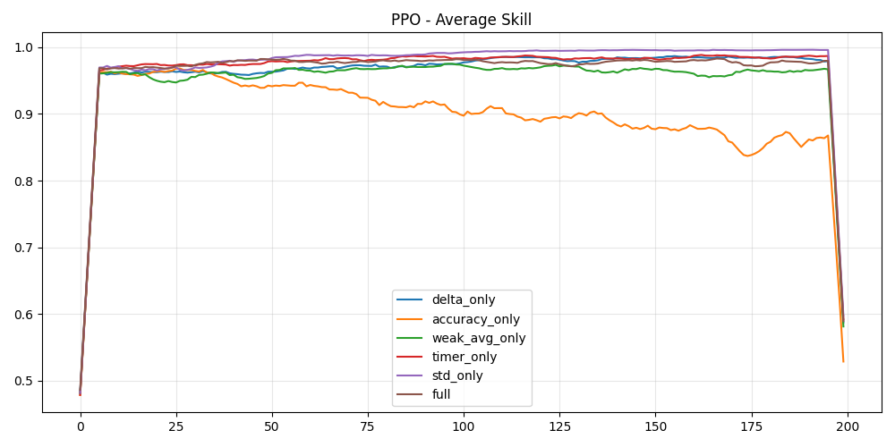
  &nbsp;
  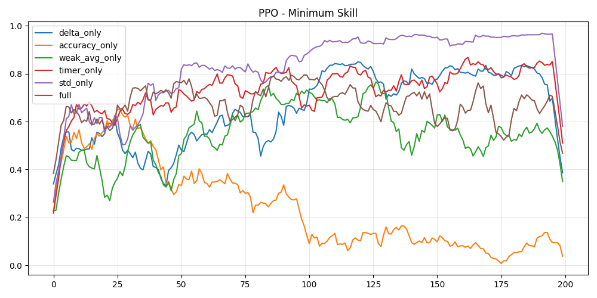
</p>

<p align="center">
  <em>Left: Average skill &nbsp;|&nbsp; Right: Minimum skill under each reward configuration.</em>
</p>

<p align="center">
  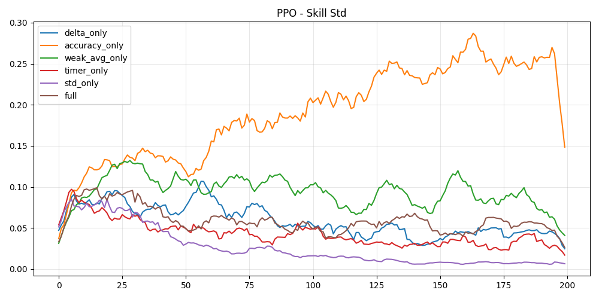
</p>

<p align="center">
  <em>Skill standard deviation — the combined reward keeps variance consistently low.</em>
</p>

> **Key insight:** Single-objective rewards reliably produce pathological behaviour. Balanced skill acquisition requires all five terms working together. Each term eliminates a specific failure mode the others cannot.

---

### Forgetting Mechanism Ablation

Linear vs. logarithmic forgetting compared across both PPO and DQN.

| Forgetting | Avg Skill | Min Skill | Stability |
|------------|-----------|-----------|-----------|
| Linear | Moderate | Drops frequently | ❌ Low |
| **Logarithmic** | **High** | **Stable** | ✅ High |

#### PPO — Forgetting Comparison

<p align="center">
  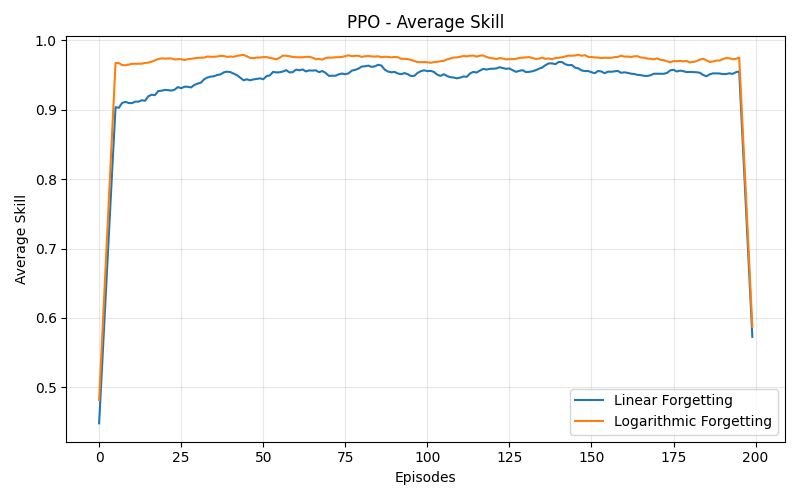
  &nbsp;
  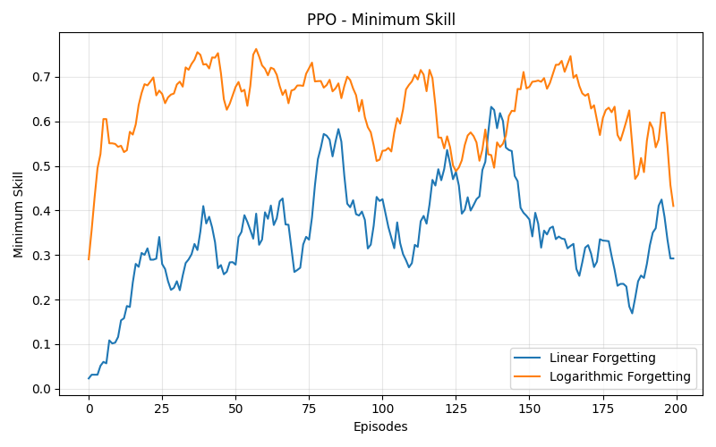
  &nbsp;
  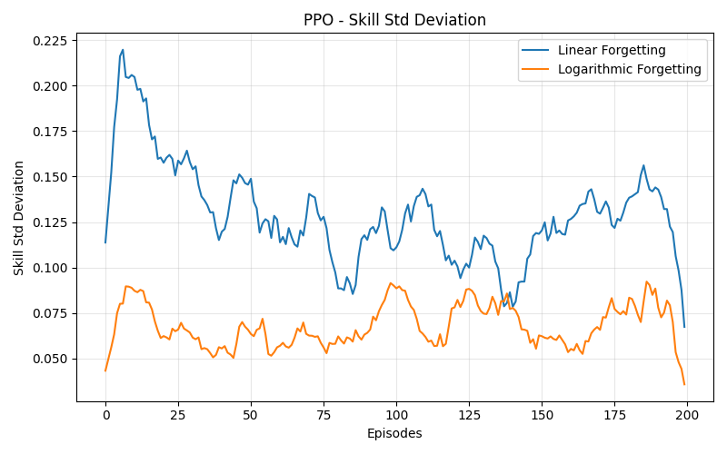
</p>

<p align="center">
  <em>Average skill &nbsp;|&nbsp; Minimum skill &nbsp;|&nbsp; Std dev — linear vs. logarithmic forgetting (PPO)</em>
</p>

#### DQN — Forgetting Comparison

<p align="center">
  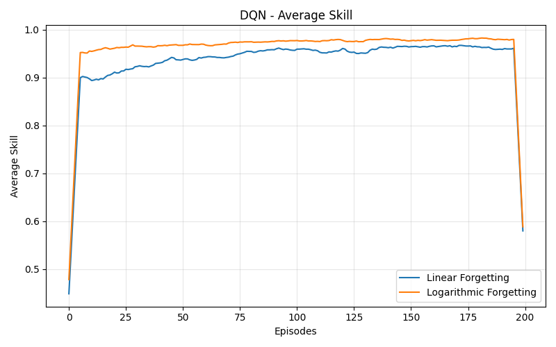
  &nbsp;
  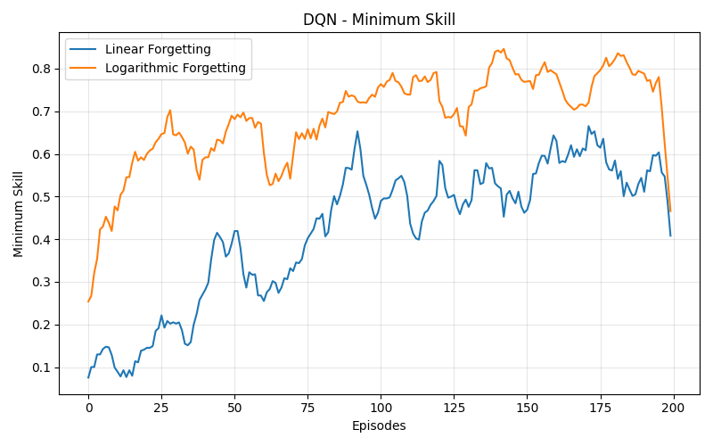
  &nbsp;
  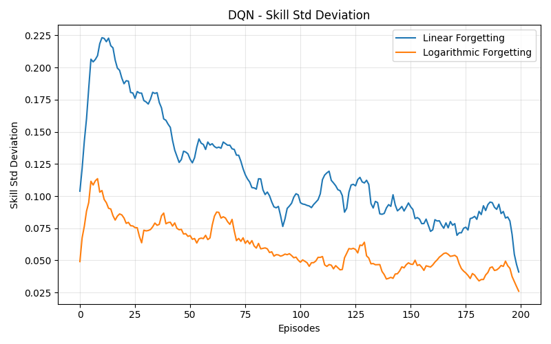
</p>

<p align="center">
  <em>Average skill &nbsp;|&nbsp; Minimum skill &nbsp;|&nbsp; Std dev — linear vs. logarithmic forgetting (DQN)</em>
</p>

Linear forgetting causes aggressive skill decay, with frequent drops in minimum skill and overall instability. Logarithmic decay is smooth and proportional — mastered skills decay slowly, giving the agent time to schedule revisitations before performance degrades.

---

## 🎬 Before & After Reward Tuning

The fastest way to see whether a reward change actually helps: animated comparison of all agents over training episodes.

### Before Reward Tuning

<p align="center">
  
</p>

Heavy emphasis on average skill growth — looks good in aggregate but neglects weak bigrams entirely.

### After Reward Tuning

<p align="center">
  
</p>

Better balance between global improvement, weak-bigram recovery, and revisitation. Notice the consistently improving minimum skill across all agents.

---

## 🗂 Project Structure

```
TypeRL/
│
├── agents/                          # All RL agents
│   ├── rule_based_agent.py          # Deterministic greedy baseline
│   ├── q_learning.py                # Tabular Q-Learning
│   ├── dqn_agent.py                 # Deep Q-Network (PyTorch)
│   ├── reinforce.py                 # REINFORCE policy gradient
│   ├── actor_critic.py              # Actor-Critic
│   └── ppo.py                       # Proximal Policy Optimization ⭐
│
├── ablation/                        # Ablation experiment infrastructure
│   ├── reward_configs.py            # Reward term configurations
│   ├── forgetting_configs.py        # Forgetting mechanism configurations
│   ├── run_reward_ablation.py       # Run reward ablation
│   ├── run_forgetting_ablation.py   # Run forgetting ablation
│   ├── plot_reward_ablation.py      # Plot reward ablation results
│   ├── plot_forgetting_ablation.py  # Plot forgetting ablation results
│   ├── generate_forgetting_table.py
│   ├── results_ablation_table.py    # Generate LaTeX result tables
│   └── results/                     # Saved ablation plots and CSVs
│       ├── PPO_avg.png / PPO_min.png / PPO_std.png
│       ├── DQN_avg.png / DQN_min.png / DQN_std.png
│       ├── *_forgetting.png
│       ├── reward_ablation.csv
│       └── forgetting_ablation.csv
│
├── representations/                 # Visualisation and animation tools
│   ├── visualizer.py                # Bigram skill heatmap visualiser
│   ├── visual_env_runner.py         # Runs an agent and records frames
│   ├── compare_visuals.py           # Side-by-side animated agent comparison
│   └── agents_wrapper.py            # Unified agent interface for visualiser
│
├── models/                          # Saved model weights
│   ├── ppo_model.pth
│   ├── dqn_model_best.pth
│   ├── dqn_model_final.pth
│   ├── actor_critic.pth
│   └── reinforce.pth
│
├── figs/                            # All output plots and animations
│
├── typing_env.py                    # Core RL environment (MDP)
├── bigrams.py                       # 40 tracked English bigrams
├── text_processing.py               # Bigram extraction from sentences
├── dataset_loader.py                # O(1) sentence sampling by (bigram, difficulty)
├── generate_dataset.py              # LLM dataset generation (Groq / Llama 3.1)
├── clean_dataset.py                 # Dataset cleaning and validation
├── dataset_quality.py               # Dataset quality diagnostics
├── compare_agents.py                # Train and compare all agents
├── tune_reward_optuna.py            # Optuna reward weight search
├── visualize_learning.py            # Plot learning and forgetting curves
├── app.py                           # Streamlit web application entry point
├── typing_component.py              # Interactive typing UI (HTML/JS in Streamlit)
├── typing_dataset_cleaned.csv       # Final cleaned dataset (4,000 sentences)
└── typing_dataset.csv               # Raw generated dataset
```

---

## 🚀 Getting Started

### 1. Clone the repo

```bash
git clone https://github.com/your-username/TypeRL.git
cd TypeRL
```

### 2. Create and activate a virtual environment

```bash
python -m venv venv
source venv/bin/activate       # macOS / Linux
venv\Scripts\activate          # Windows
```

### 3. Install dependencies

```bash
pip install numpy torch matplotlib streamlit groq python-dotenv optuna tenacity
```

### 4. Generate the dataset *(skip if `typing_dataset_cleaned.csv` already exists)*

```bash
echo "GROQ_API_KEY=your_key_here" > .env
python generate_dataset.py
python clean_dataset.py
```

Dataset: 40 bigrams × 5 difficulties × 20 sentences = **4,000 sentences**, each containing the target bigram at least 5 times and matching the assigned difficulty level.

### 5. Train and compare all agents

```bash
python compare_agents.py
```

### 6. Train individual agents

```bash
python agents/rule_based_agent.py
python agents/q_learning.py
python agents/dqn_agent.py
python agents/reinforce.py
python agents/actor_critic.py
python agents/ppo.py
```

### 7. Run ablation studies

```bash
# Reward component ablation
python ablation/run_reward_ablation.py
python ablation/plot_reward_ablation.py

# Forgetting mechanism ablation
python ablation/run_forgetting_ablation.py
python ablation/plot_forgetting_ablation.py
```

### 8. Generate visualisations and animations

```bash
python visualize_learning.py
python representations/compare_visuals.py
```

### 9. Launch the interactive app

```bash
streamlit run app.py
```

---

## 🧩 Dataset

Sentences were generated using **Llama 3.1-8b via Groq API**.

$$40 \text{ bigrams} \times 5 \text{ difficulties} \times 20 \text{ sentences} = 4{,}000 \text{ sentences}$$

Each sentence is constrained to:
- Contain the target bigram **at least 5 times**
- Use natural, fluent English prose
- Match the assigned difficulty level (simple vocabulary at level 0 → complex sentence structure at level 4)

This decouples sentence generation from the learning model — any sentence source that provides bigram counts is compatible.

---

## 🧠 Key Design Decisions

| Decision | Choice | Rationale |
|----------|--------|-----------|
| Skill representation | Bigram vector (40-dim) | Errors are localized to specific transitions; targeting them produces global fluency gains |
| Forgetting model | Logarithmic $\log(1 + t_b)$ | Prevents skill collapse during gaps; linear decay was too aggressive in practice |
| Difficulty scaling | Superlinear $d_\ell = 0.2 \cdot \ell^{1.5}$ | Keeps the difficulty axis informative; linear scaling underestimated high-level hardness |
| State representation | Full $\mathbb{R}^{80}$ (skills + timers) | Without timers, the agent has no signal to revisit neglected bigrams |
| Reward | Multi-objective (5 terms, Optuna-tuned) | Single-objective rewards reliably produce failure modes; all terms are necessary |
| Policy | PPO | Best trade-off between exploration, stability, and sample efficiency |
| Sentences | LLM-generated (Groq / Llama 3.1) | Controlled difficulty, guaranteed bigram density, easily swappable |

---

## 🔭 Future Work

- **Real user integration** — validate and calibrate against actual typing data; enable personalised model fitting
- **Continuous action space** — move beyond discrete difficulty levels to finer-grained curriculum control
- **Personalised difficulty curves** — adapt the difficulty axis to individual typing patterns
- **Speed & error-correction objectives** — extend reward to cover typing speed and correction behaviour alongside accuracy
- **Human-in-the-loop learning** — online user feedback for more interactive, responsive training
- **Generalisation to other domains** — the framework is domain-agnostic and directly applicable to language learning, music practice, or motor skill acquisition

---

## 📄 Citation

If you use TypeRL in your research or build on it, please cite:

```bibtex
@misc{typerl2025,
  title   = {TypeRL: Reinforcement Learning for Adaptive Typing Practice},
  year    = {2025},
  url     = {https://github.com/your-username/TypeRL}
}
```

---

## 📜 License

MIT License — see [LICENSE](LICENSE) for details.